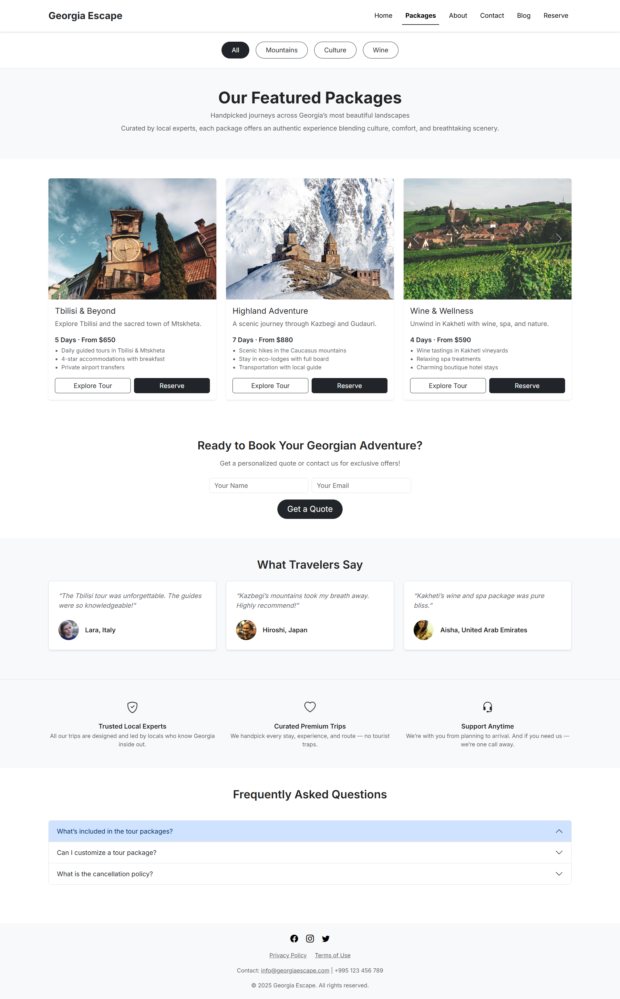
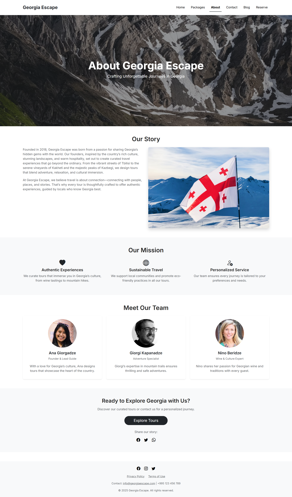
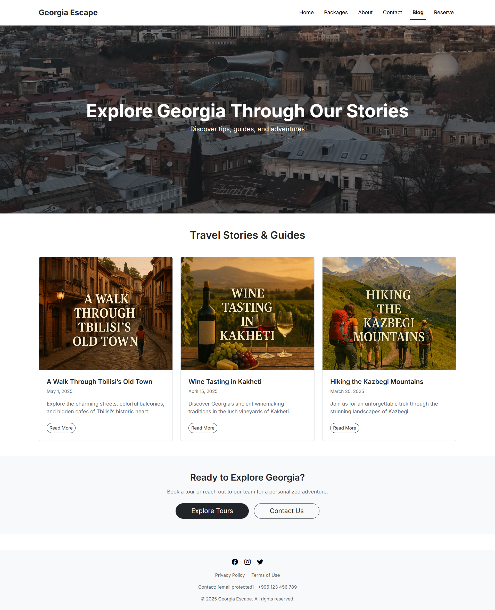
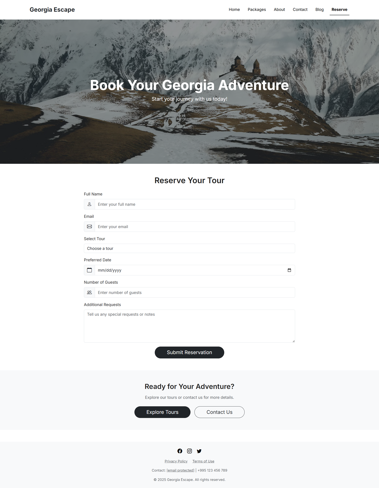
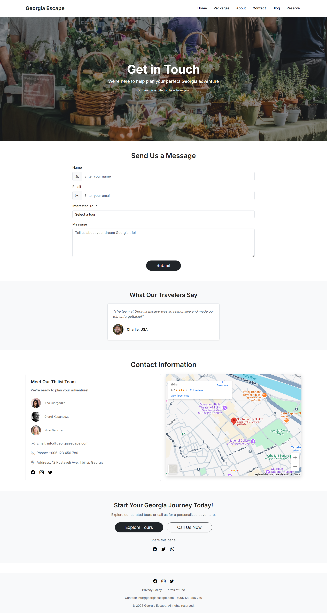

# 🏔️ Georgia Escape — Showcase

> 💡 **Frontend Practice Project**  
> เว็บไซต์แพลตฟอร์มจองทัวร์ประเทศจอร์เจีย (Georgia) ที่พัฒนาด้วย HTML, CSS, JavaScript และ Bootstrap

---

## 🚀 Live Demo

เข้าชมเว็บไซต์: 👉 **[georgia-escape-demo.vercel.app](https://georgia-escape-demo.vercel.app)**

---

## 📖 เกี่ยวกับโปรเจกต์

**Georgia Escape** เป็นโปรเจกต์ฝึกปฏิบัติพัฒนา Frontend ที่เน้นการออกแบบ UI/UX สำหรับเว็บไซต์ท่องเที่ยว

### 🎯 วัตถุประสงค์
- ฝึกการจัดวางเลย์เอาต์และโครงสร้าง HTML ที่ถูกต้อง
- เรียนรู้การใช้ **Bootstrap** ในการสร้าง Responsive Design
- พัฒนาทักษะการออกแบบ UI ที่สวยงามและใช้งานง่าย
- ฝึกการสร้างเว็บไซต์แบบหลายหน้า (Multi-page Website)

---

## ✨ ฟีเจอร์หลัก

- 🏠 **Homepage** - หน้าแรกพร้อมแบนเนอร์และแพ็กเกจแนะนำ
- 📦 **Package Listing** - แสดงแพ็กเกจทัวร์ทั้งหมด
- 📍 **Tour Details** - รายละเอียดแต่ละแพ็กเกจ (Tbilisi, Highland, Wine Tour)
- 📰 **Blog Section** - บทความและเนื้อหาท่องเที่ยว
- 📝 **Reservation Form** - ฟอร์มจองทัวร์
- ℹ️ **About & Contact** - ข้อมูลเกี่ยวกับบริษัทและการติดต่อ
- 📱 **Responsive Design** - รองรับทุกขนาดหน้าจอ

---

## 🛠️ เทคโนโลジีที่ใช้

| หมวด | เทคโนโลยี |
|------|-----------|
| **Frontend** | HTML5, CSS3, JavaScript |
| **Framework** | Bootstrap 5 |
| **Fonts** | Google Fonts (Poppins, Roboto) |
| **Icons** | Font Awesome |
| **Deployment** | Vercel |

---

## 📸 Screenshots

<details>
<summary>คลิกเพื่อดูภาพหน้าจอทั้งหมด</summary>

### Homepage


### Packages


### Tour Details - Tbilisi


### Tour Details - Highland


### Tour Details - Wine


### About Page


### Blog


### Reservation Form


### Contact


</details>

---

## 📂 โครงสร้างโปรเจกต์

```
georgia-escape-demo/
├── georgia-escape-code-examples/
│   ├── screenshots-web-project/    # Screenshot ทุกหน้า
│   │   ├── about.png
│   │   ├── blog.png
│   │   ├── contact.png
│   │   ├── index.png
│   │   ├── packages.png
│   │   ├── reserve.png
│   │   ├── tour-details-highland.png
│   │   ├── tour-details-tbilisi.png
│   │   └── tour-details-wine.png
│   ├── index.html                  # หน้าแรก
│   ├── packages.html               # หน้าแพ็กเกจทัวร์
│   ├── about.html                  # เกี่ยวกับเรา
│   ├── blog.html                   # บล็อก
│   ├── contact.html                # ติดต่อเรา
│   ├── reserve.html                # ฟอร์มจอง
│   ├── tour-details.html           # รายละเอียดทัวร์ Tbilisi
│   ├── tour-details-highland.html  # รายละเอียดทัวร์ Kazbegi
│   └── tour-details-wine.html      # รายละเอียดทัวร์ Kakheti
├── .gitignore
├── vercel.json
└── README.md
```

---

## 📌 สิ่งที่รวมอยู่ใน Repository นี้

⚠️ **หมายเหตุสำคัญ:** Repository นี้เป็น **showcase เท่านั้น** 

✅ **สิ่งที่มีใน Repo:**
- ตัวอย่างโค้ด HTML หน้าหลักๆ
- Screenshots ทุกหน้า
- โครงสร้างและการออกแบบ UI

❌ **สิ่งที่ไม่มีใน Repo:**
- โค้ดเต็มรูปแบบทั้งหมด
- Backend / Database
- ไฟล์ assets บางส่วน

> 💡 โปรเจกต์นี้จัดทำเพื่อการเรียนรู้และแสดงผลงานเท่านั้น

---

## 👨‍💻 ผู้พัฒนา

**ภูริพัฒนชัย รัตนาธรรม**  
- GitHub: [@ctrlfaith](https://github.com/ctrlfaith)
- ประเภท: Frontend Practice Project

---

## 📄 License

โปรเจกต์นี้จัดทำเพื่อการศึกษาและฝึกปฏิบัติเท่านั้น  
ไม่มีการใช้งานเชิงพาณิชย์

---

## 💭 หมายเหตุ

> "Georgia Escape เป็นจุดเริ่มต้นของการฝึกฝนการออกแบบเว็บไซต์  
> ที่มุ่งเน้นความสวยงาม โครงสร้างเข้าใจง่าย และสามารถต่อยอดพัฒนาได้ในอนาคต"
